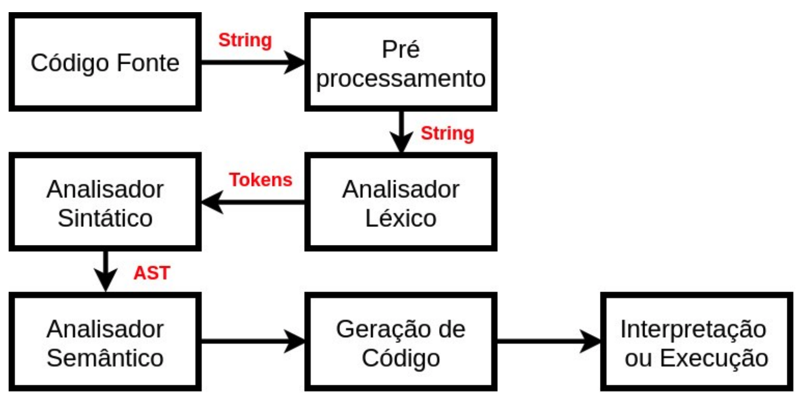
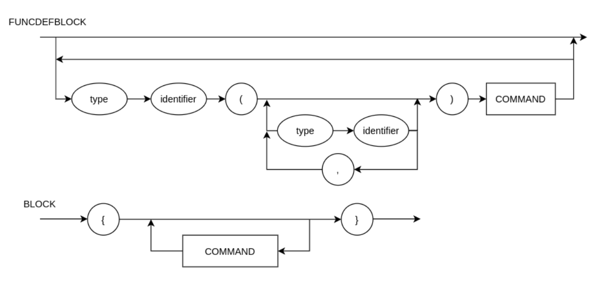
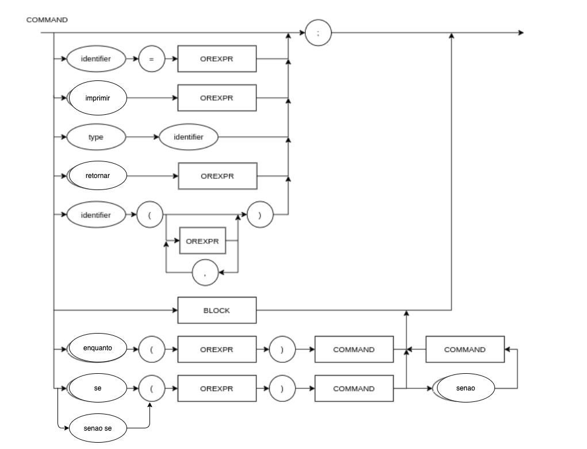
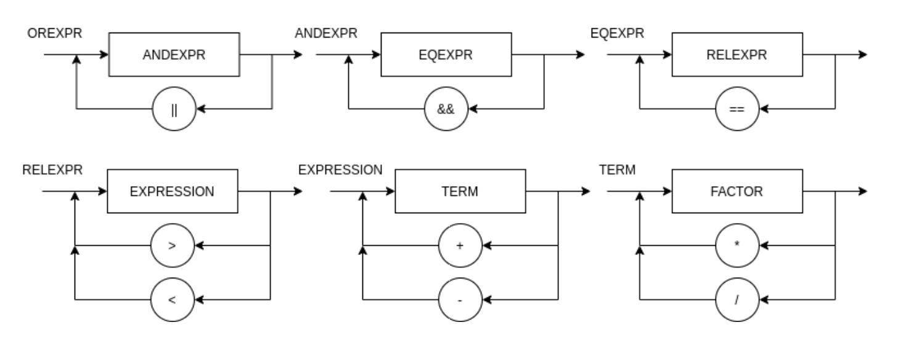
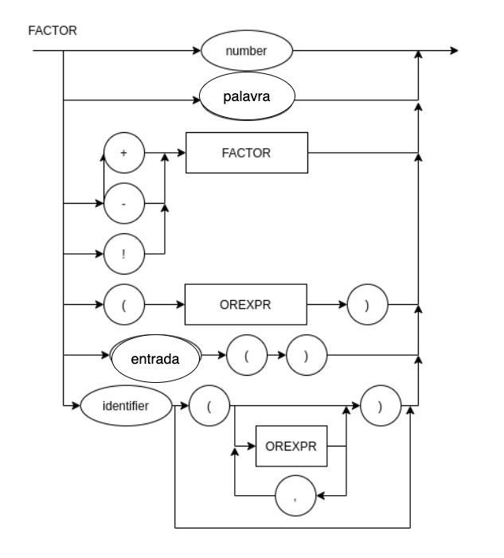

# CBR - O C que é BR

## Programação para não-programadores não-fluentes em inglês

Lógica da Computação - Engenharia da Computação - Insper 7° Semestre

**Professor:** Maciel Calebe

**Aluno:** Rafael Almada

> Atividade Prática Supervisionada

___

## Contextualização

Linguagens de programação são o meio que humanos se comunicam com máquinas, dando ordens em comandos que são interpretados e, em seguida, executados pelo computador. Com o mundo cada vez mais digital, o conhecimento sobre o mundo tecnológico se tornou algo valioso de forma que ao se saber programar, muitas portas se abrem para o programador.

Sabe-se que, por conta das linguagens terem sido feitas, na maioria dos casos, por pessoas que falavam nativamente inglês, quase todas possuem verbos, expressões e ideias que são passadas ao programador em inglês. Sabe-se também que, no Brasil, dificilmente pessoas de baixa renda têm acesso à educação de outras línguas que não o português e por conta disso, muitos possíveis programadores acabam desistindo da programação por necessitar não só de um conhecimento de computação, como também de um conhecimento da língua inglesa.

Este projeto nasceu com o intuito de ajudar àqueles programadores que não sabem inglês a entender um pouco melhor o mundo da programação sem que exista a barreira da língua. Desta forma surgiu o CBR.

## Sobre a linguagem

A linguagem foi desenvolvida como um projeto da disciplina de Lógica da Computação e utiliza um sistema de árvore sintática abstrata (AST) que permite o funcionamento de um código produzido utilizando as regras presentes na EBNF da linguagem (presente abaixo) e as regras de funcionamento.

A sintaxe é parecida com a sintaxe da linguagem C, apesar de ter sido feita e compilada em python.

## Diferenças entre C e CBR

O C é uma linguagem bem completa e cheio de bibliotecas, tanto as padrões, como as feitas por usuários. O CBR implementa o básico que permite um programador de criar e pensar em seu código, mas funcionalidades prontas como vetores, listas e dicionários não existem aqui. 

## Como programar em CBR

O CBR trabalha com um esquema de funções que exige que o usuário trabalhe na função **'principal'** (que equivale a **"main"** de c), mas também permite que o usuário tenha a liberdade de criar novas funções a qualquer momento.
Além disso, o CBR trabalha com três tipos de variáveis, sendo elas: 'int' (inteiro), 'bool' (booleano) e 'palavra' (string), mas já em funções, ele trabalha com 4 tipos, sendo: 'int' (inteiro), 'bool' (boolean), 'palavra' (string) e 'vazio' (void).

Para a criação de variáveis, no CBR, é necessário que o programador primeiro declare a variável com seu tipo e somente depois associe aquela variável a um valor.

```
int x;
x = 10;
```

Para realizar condições, é necessário utilizar o 'se' (if). Caso necessário, o programador pode utilizar uma cláusula 'senao' (else) e cláusulas 'senao se' (else if), o número de vezes que desejar.

```
se (x > 2) {
    /*Realiza tarefas*/
} senao se (x < 2) {
    /*Realiza tarefas*/
} senao {
    /*Realiza tarefas*/
}
```

Para a construção de loops, é necessário utilizar laços 'enquanto' (while).

```
enquanto (x < 5) {
    /*Realiza tarefas*/
    x = x + 1;
}
```

É possível também pedir para o usuário colocar entradas para o usuário inserir, porém ela só permite que a entrada seja lida como inteiro

```
int x;
x = entrada();
```

Booleanas podem aceitar tanto operações, como podem aceitar um valor 'verdadeiro' (true) ou 'falso' (false).

```
bool x;
x = 1 == 1;
x = verdadeiro;
x = falso;
```

Já 'palavras' podem ser associadas apenas a valores entre aspas duplas.

```
palavra x;
x = "cbr é demais!"
```

Inteiros 'int' só aceitam valores inteiros.

```
int x;
x = 15;
```

Além de tudo o que já foi mostrado, ainda é possível que o programador faça comentários em partes específicas do código!

```
/*Isto é um comentário e não será interpretado pelo compilador*/
```

Toda função que não for do tipo 'vazio' deve retornar algum valor utilizando 'retornar', a única exceção é a função 'principal'.

```
palavra funcao1() {
    retornar "cbr é demais!";
}

bool funcao2() {
    retornar (3 > 2);
}

int funcao3() {
    retornar 1;
}

vazio funcaoVazia() {
    /*Pode realizar tarefas aqui, mas nada disso voltará para a função que a chamou originalmente*/
}

int principal() {
    funcao1();
    funcao2();
    funcao3();
    funcaoVazia();
}
```

> Obs: É importante ressaltar que o código acima deveria retornar erro pelo fato de a função vazia não ter nenhuma linha de código após remover o comentário

Por fim, é necessário dizer que o compilador de CBR só lê arquivos **'.cbr'**.

## Para a instalação

**Forma 1:**

Primeiro para deixar tudo pronto para o uso:

```
$ git clone https://github.com/slimkaki/Compilador
$ cd Compilador/
$ chmod +x gcbr
```

Depois, para o uso, basta estar na pasta do compilador e:

```
$ ./gcbr path/para/o/arquivo/<nome-do-arquivo>.cbr
```

**Forma 2:**

Primeiro você deve clonar o repositório:

```
$ git clone https://github.com/slimkaki/Compilador
$ cd Compilador/
```

E em seguida deverá realizar o seguinte para o uso do compilador:

```
$ python3 main.py path/para/o/arquivo/<nome-do-arquivo>.cbr
```

> Obs: Você deve trocar `path/para/o/arquivo/<nome-do-arquivo>.cbr` pelo path para o arquivo **'.cbr'**.

## Exemplos de código CBR

**Exemplo 1:**

```
bool retorna_falso () { 
    /*Função que retorna um booleano falso*/
    retornar falso;
}

int principal () {
    /*Função principal (main)*/
    retorna_falso();

    diga_meu_nome("Walter White");

    int a;
    a = potencia(10, 2);

    imprimir("valor do a:");
    imprimir(a);

}

vazio diga_meu_nome (palavra nome) {
    /*Função que não retorna nada, mas pode fazer operações da linguagem*/
    imprimir("Você está certo!"); /*Heisenberg*/
}

int potencia (int numero, int potencia) {
    /*Função que eleva um numero a uma potencia*/
    int i;
    i = 1;
    enquanto(i < potencia) {
        numero = numero * numero;
        i = i + 1;
    }
    retornar numero;
}
```

Saída do programa:

```
$ ./gcbr exemplo1.cbr
Você está certo
valor do a:
0
```

**Exemplo 2:**

```
vazio loop(int x) {
    /*Função que roda em loop por 5 iterações*/
    enquanto (x < 5) {
        imprimir(x);
        x = x + 1;
    }
    imprimir("Acabou o loop!");
}

int principal() {
    /*Função principal (main)*/
    int a;
    a = 0;
    loop(a);
}
```

Saída do programa:

```
$ ./gcbr exemplo2.cbr
0
1
2
3
4
Acabou o loop!
```

**Exemplo 3:**

```
int principal() {
    /*Função principal (main)*/
    int x;
    x = 50;
    se (x > 50) {
        imprimir("x é maior que 50");
    } senao se (x < 50) {
        imprimir("x é menor que 50");
    } senao se (x == 50) {
        imprimir("x é igual a 50");
    } senao {
        imprimir("eu não sei o que é x");
    }
}
```

Saída do programa:

```
$ ./gcbr exemplo3.cbr
x é igual a 50
```

> Obs: Os exemplos estão presentes na raiz deste diretório com os nomes "exemplo1.cbr", "exemplo2.cbr" e "exemplo3.cbr"

## Processamento da Linguagem



## Diagrama Sintático









## EBNF - Linguagem _"cbr"_

```
FUNCDEFBLOCK = { TYPE, IDENTIFIER, "(", { TYPE, IDENTIFIER, "," }, ")", BLOCK } ;
BLOCK = "{", { COMMAND }, "}" ;
COMMAND = ( λ | DECLARATION | ASSIGNMENT | PRINT | INPUT | CONDITION | LOOP | RETURN | FUNCCALL ), ";" ;
TYPE = ( "int" | "bool" | "palavra" ) ;
DECLARATION = TYPE, IDENTIFIER ;
ASSIGNMENT = IDENTIFIER, "=", ( EXPRESSION | STRING | BOOLEAN | CONDITIONEXP | FUNCCALL ) ;
STRING = '"', { LETTER | DIGIT | " " | "+" | "-" | "*" | "/" | "_" | ... | "(" | ")" | "|" | "&" }, '"' ;
BOOLEAN = ( "verdadeiro" | "falso" ) ;
PRINT = "imprimir", "(", EXPRESSION, ")" ;
FUNCCALL = IDENTIFIER, "(", { TYPE, IDENTIFIER, "," }, ")" ;
RETURN = "retornar", ( IDENTIFIER | NUMBER | EXPRESSION | BOOLEAN | CONDITIONEXP ) ;
LOOP = "enquanto", "(", CONDITIONEXP, ")", "{", BLOCK, "}" ;
CONDITION = IF, "{", BLOCK, "}", { ( ELSEIF, ELSE ), "{", BLOCK, "}" } ;
CONDITIONEXP = ( NEG, "" ), ( LESSER | GREATER | LESSEREQ | GREATEREQ | UNEQ | EQEXP ), { ("||", "&&"),  ( NEG, "" ), ( ( LESSER | GREATER | LESSEREQ | GREATEREQ | UNEQ | EQEXP ) ) } ;
IF = "se", "(", CONDITIONEXP, ")" ;
ELSEIF = "senao se", "(", CONDITIONEXP, ")" ;
ELSE = "senao" ;
NEG = "!" ;
LESSER = ( NUMBER | IDENTIFIER ), "<", ( NUMBER | IDENTIFIER ) ;
GREATER = ( NUMBER | IDENTIFIER ), ">", ( NUMBER | IDENTIFIER ) ;
LESSEREQ = ( NUMBER | IDENTIFIER ), "<=", ( NUMBER | IDENTIFIER ) ;
GREATEREQ = ( NUMBER | IDENTIFIER ), ">=", ( NUMBER | IDENTIFIER ) ;
EQEXP = ( NUMBER | IDENTIFIER ), "==", ( NUMBER | IDENTIFIER ) ;
UNEQ = ( NUMBER | IDENTIFIER ), "!=", ( NUMBER | IDENTIFIER ) ;
INPUT = "entrada", "(", ")" ;
EXPRESSION = TERM, { ("+" | "-"), TERM } ;
TERM = FACTOR, { ("*" | "/"), FACTOR } ;
FACTOR = (("+" | "-"), FACTOR) | NUMBER | "(", EXPRESSION, ")" | IDENTIFIER ;
IDENTIFIER = LETTER, { LETTER | DIGIT | "_" } ;
NUMBER = DIGIT, { DIGIT } ;
STRING = ( "'" | """ ) , { LETTER | DIGIT }, ( "'" | """ ) ;
LETTER = ( a | ... | z | A | ... | Z ) ;
DIGIT = ( 1 | 2 | 3 | 4 | 5 | 6 | 7 | 8 | 9 | 0 ) ;
```

## Testes

Por fim, os testes unitários podem ser facilmente encontrados no arquivo *test_Finais.py* e podem ser rodados utilizando pytest.

Para rodar os testes basta rodar também no diretório raiz:

```sh
$ pytest
```
